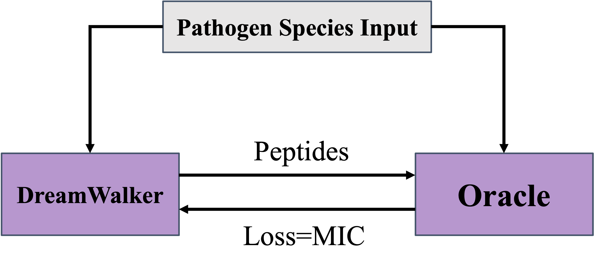

# DreamWalker
DreamWalker is a deep learning model for _de novo_ design of antimicrobial peptides (AMP) through the hallucination-guided mechanism. The hallucination framework consist of two components. The first component is an Oracle model which predicts the minimal inhibitory concentration (MIC) value of an AMP to a given target species. The second component is a Generator model from a pre-trained GAN. As the Generator designs new peptides, the evaluation of Oracle is returned as the loss. This approach allows the Generator to explore the hallucination landscape of the Oracle and discover new AMPs with specificity. This work has been presented on the [2024 MIT-MGB AI Cures Conference](https://www.mitmgb.ai/posters).

DreamWalker was trained and tested using Python 3.8 on Google Colab with one T4 GPU.

This is the initial version of the code. It contains MICPredictor, PeptideGenerator, and DreamWalker. The results are plotted in visualization file. 

Link to the previous version of the project: https://github.com/AvonYangXX1/AMPLify-Feedback

# Citation
Miao, J., Yang, S., & Collin, A. (2024). _De novo Design of Antimicrobial Peptides by Hallucination-Guided Generative Adversarial Networks_ [Poster presentation]. 2024 MIT-MGB AI Cures Conference, Boston, MA. https://www.mitmgb.ai/posters